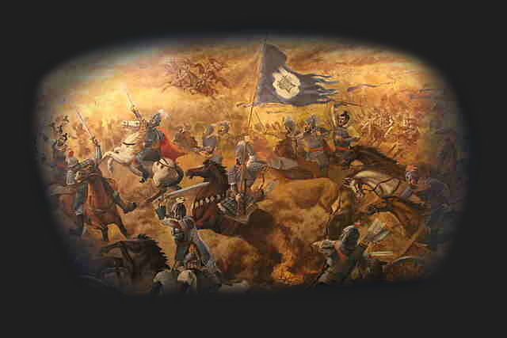

# 🌐 Welcome to the Pax Historia Wiki

Begin by trying a game from our variety of presets. Scheme and sow discord, or unify and build trust.&#x20;



Play the 20th century large scale warfare experience, send the Zimmerman Telegraph, ship off Lenin, launch Operation Sealion, experience the endless schemes and realpolitik of Bismarck's Era, conquer and achieve glory in the middle ages of a medieval Europe, sacrifice tribute as the Aztecs, fight over Jing Province, or trick other factions into doing your dirty work.&#x20;

<figure><figcaption></figcaption></figure>

<figure><figcaption></figcaption></figure>

<figure><figcaption></figcaption></figure>

Anything! Follow the actions of history, or, create your own schemes, experiencea custom timeline, launch any operation. Do whatever and the timeline will react to it.\
\
Here on the wiki, there will be guides on how to play, how to create preset timelines for specific settings, and other details. Development is easy and sustainable!
