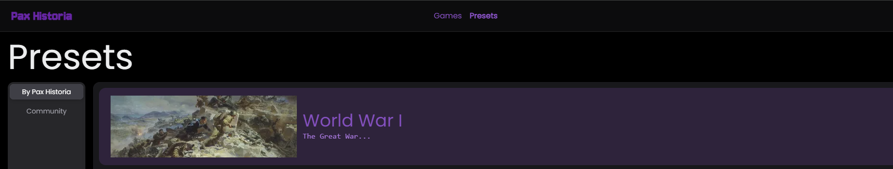

# 🎱 Editing Presets

Presets are historical context for games. This is where you can make Specific Historical Events, like Any Year you'd want! \
\
Or a non-historical fantasy setting if you'd like, or if you'd like more maps than the array provided by the Pax Historia Team. However, that does require a new map which can be complicated. It's not too hard just complex. Since the procedure of making a new map is constant, it is do-able but takes a long time.\
\
Anyways, besides that there are the details of the game. Demographics, Economies, Factions in that time, the Date, along with the owners of regions, ext. These can all be edited with ease.

<figure><figcaption></figcaption></figure>
