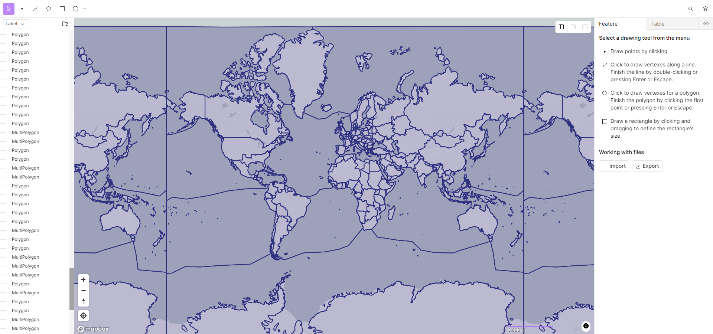
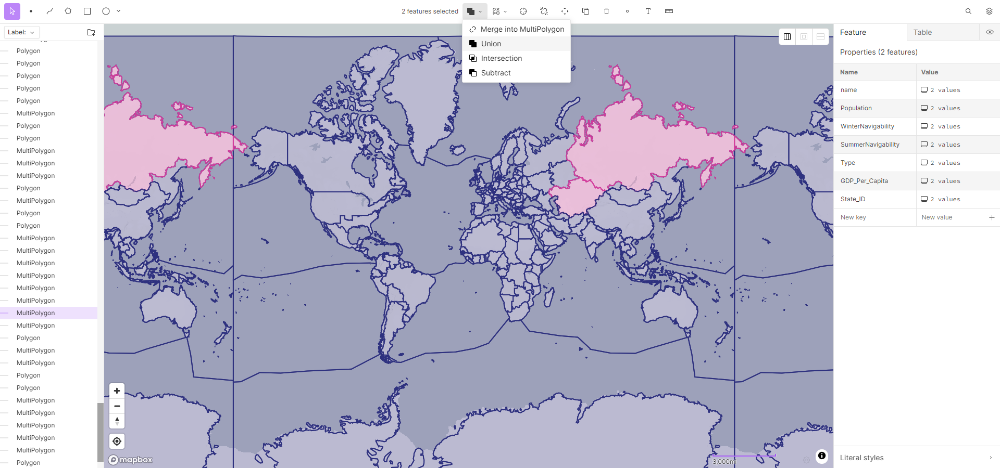

# 👺 Advanced

This area has a bunch of details for coders who may want to create advanced details, like new maps or new regions in addition to the ones available in the array of maps made by Pax Historia.\
\
The Open Source Mapping Softwares that Pax Historia uses to create maps are Play.Placemark.io and Mapshaper.org. \
\
The Process of combining regions is do-able on Placemark.io. With the Union Tool and the selection tools. Simply click a region, Shift+Click the region you wish to merge it with, and then click the Union Button.

<figure><figcaption></figcaption></figure> <figure><figcaption></figcaption></figure>

As for manipulating the borders and creating new states, that must be done on Mapshaper with a long procedure. Files for maps must always be .geojson\
\
Make sure on the Placemark, that all the statistics for map regions are present, being Winter and Summer navigability, State ID's, regiontypes, and ext are present.\
\
On Mapshaper you can change the border locations of regions with a simple dragging method using the draw/edit polygons mouse button, with that tool it's easy to drag points and create new points on the borders.\
\
Creating new regions on Mapshaper is a longer process. \
\
Here is the procedure:\
\
1.) Use the Selection Tool to pick the region\
2.) Click the button SPLIT from the little panel that shows up on the right.\
3.) Open the Console on Mapshaper\
4.) Type in: "mapshaper lines segments" (Don't include the Quotation Marks)\
5.) Use the Draw/Edit tool to draw only ONE border of the new region, just enough lines to make the region you SPLIT become two sections. \
6.) Type in: "mapshaper polygons" (Don't include the Quotation Marks)\
7.) Type in: "mapshaper merge-layers target=1,2 force" (Don't include the Quotation Marks)\
8.) The New Region should be there, if it didn't then try again and draw the line in a slightly different configuration.\
9.) Fill in the statistics and details of the state again, this procedure does wipe those details.

<figure><figcaption></figcaption></figure> <figure><figcaption></figcaption></figure> <figure><figcaption></figcaption></figure> <figure><figcaption></figcaption></figure>

<figure><figcaption></figcaption></figure> <figure><figcaption></figcaption></figure> <figure><figcaption></figcaption></figure> <figure><figcaption></figcaption></figure>

