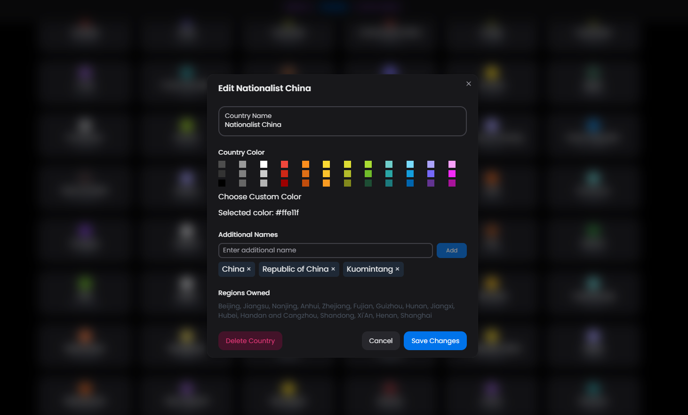

# 🏞️ Edit A Country

In a new preset you've made, or a copy of an existing one to be edited, simple select a nation from the section of "Countries" and here you can change anything you want.

The color tab will be the nations color, you can select from the array or make your own color by clicking "Choose Custom Color" (It's a button trust me).

\
The additional names section is for the A.I. to make less mistakes (which are possible). Sometimes, a nation has multiple names that can be used to refer to that nation, insert those other names in that section, and they will be compatible with the code.

<figure><figcaption></figcaption></figure>
