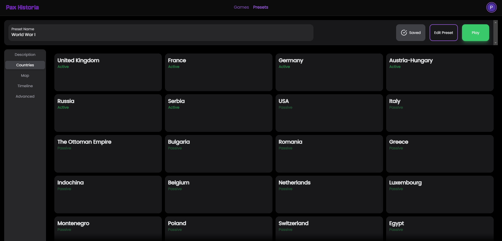
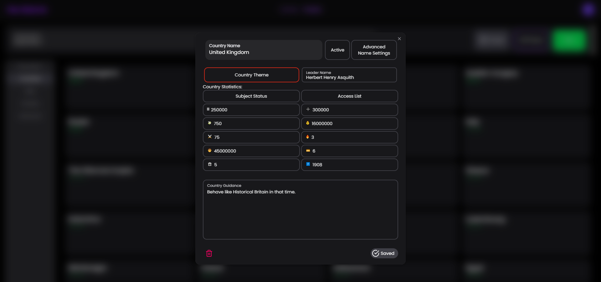
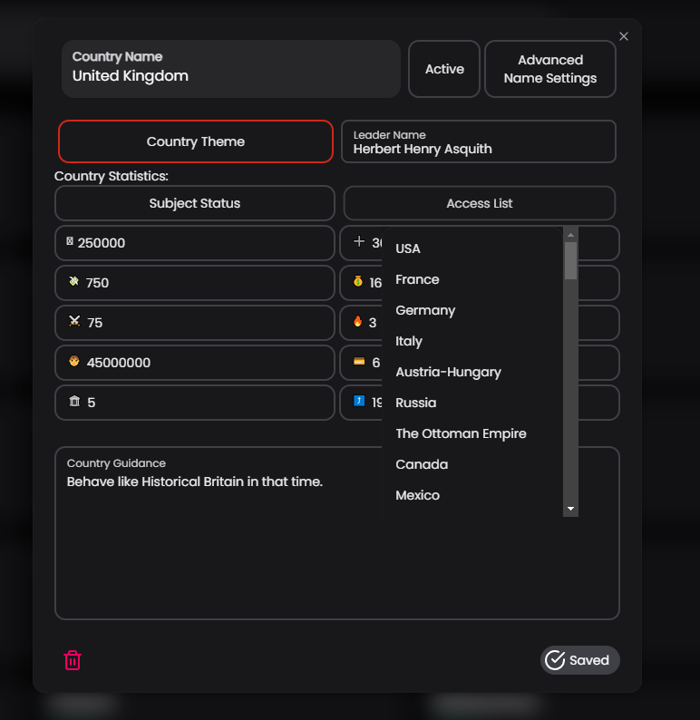
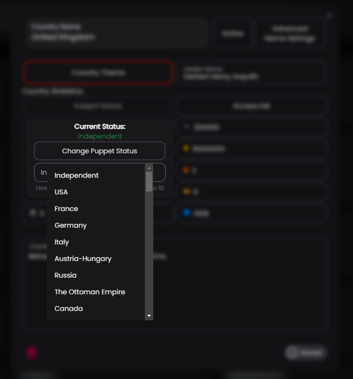

# 🏞️ Edit Countries

Simply click the countries tab in the edit presets screen, and use the + button to add factions. You can edit the statistics of these nations to be whatever you want.

<figure><figcaption></figcaption></figure>

<figure><figcaption></figcaption></figure> <figure><figcaption></figcaption></figure> <figure><figcaption></figcaption></figure>

