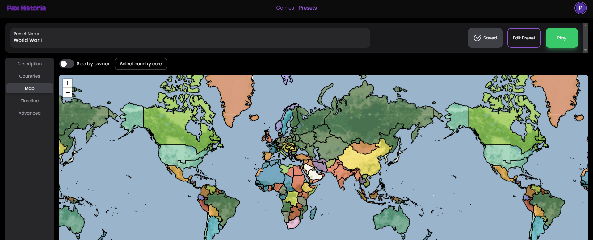

# 🖼️ Edit Map

On the map in the preset editor is where you determine the statistics, like population and whether or not regions are coastal or landlocked, of regions. And the Owner of the regions.\
\
In order to edit these stats, simply go to the map tab of the preset editor, and click the region you want to edit. Then all the stats are there to change!

<figure><figcaption></figcaption></figure>

<figure><figcaption></figcaption></figure>
