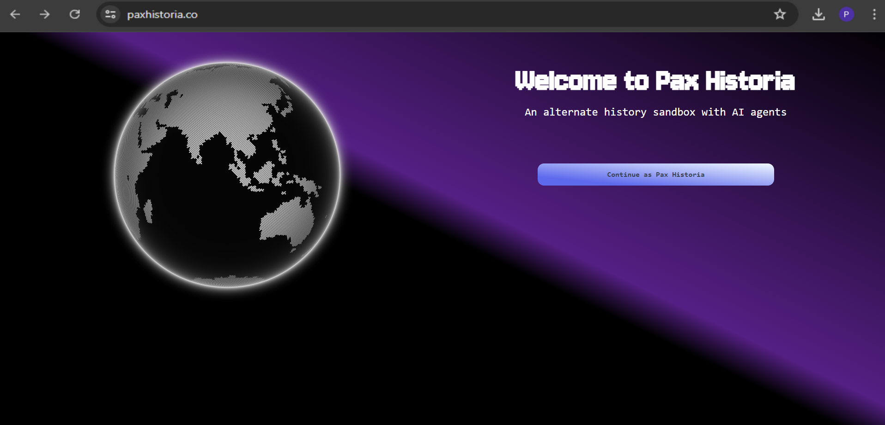
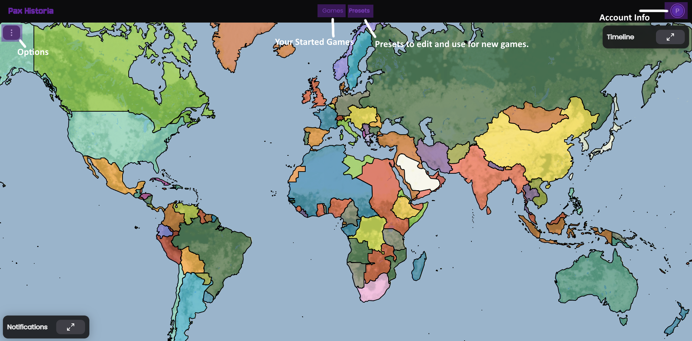

# ▶️ Gameplay

Put in paxhistoria.co into any browser, and go to town. \
Make an account or just jump right in!\
Select a preset you'd want to play.\
Pick a country and go in, now you can do anything you want.

<figure><figcaption></figcaption></figure>

The gist of things is to experience history in a more surreal way. Pax Historia's nation's that are not players are managed by actual Artificial Intelligence, like Claude or GPT. With this, diplomacy can be simulated, you can scheme and chat, and make guidelines for specific factions. Games can now be whatever you want them to be, and chances are, the A.I. will succeed in simulating the actual being. We recommend using Gemini Flash 2.5\
\
Once a game is launched/started, the screen will resemble the image below.\
\
The first button in the corner is Chats, which is where you can select specific nations to speak to.

The second button is the Actions (Lightning Bolt), which is where you can simply type up your actions, or choose from the suggested actions.

Lastly is the date/time jump button, in the top right corner. That is essentially the "time machine" / "next round" button. You can use it to go to the next round, or when the rounds pass, you can use the back arrow to view the game-state as of previous rounds.\
\
The game is a turn by turn timeline system, each turn being a time-span you can choose. The options are 1 week, 1 month, 6 months, and 1 year. When you select one of the Time Jumps, an AI will simulate the world/game, depending on your actions and the historical preset, from the date you were on, to the date you jumped to. Like a round based conquest and strategy game.&#x20;

<figure><figcaption>
This image is of the WW2 preset, there are several other historical presets to pick.
</figcaption></figure>
