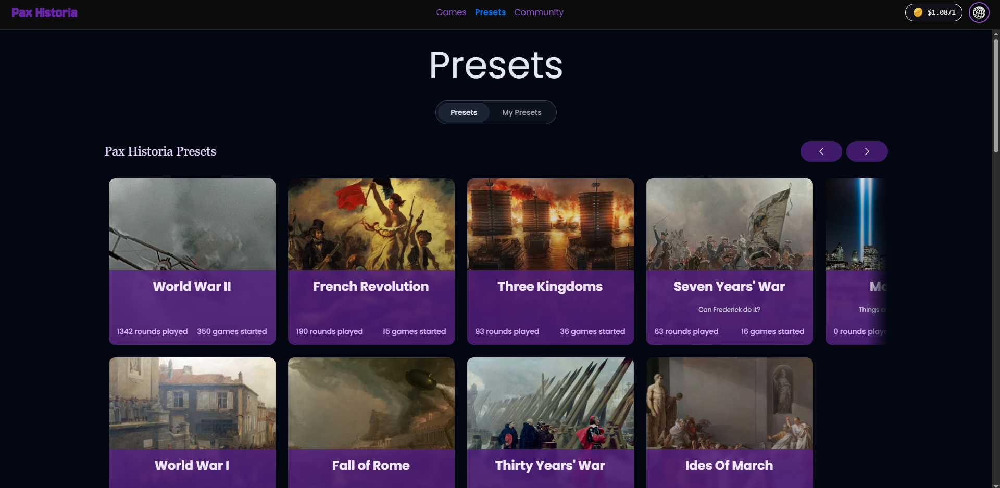

# 🐣 Creating A Game

Once you are logged in, the UI will look like the following image:

<figure><figcaption></figcaption></figure>

The following are historical presets, each with different maps and time periods. You can play any of them. In order to make the game, simply click the preset you want to play. \
\
Once you click one of the presets, simply select the big green "Play Now" button, select a country/nation to play as, and then name your game.&#x20;

Now you have your game! Games you've made will show up in the games tab. If you want to leave and return to your game, you can always find games you've made in that tab on the top-center.
