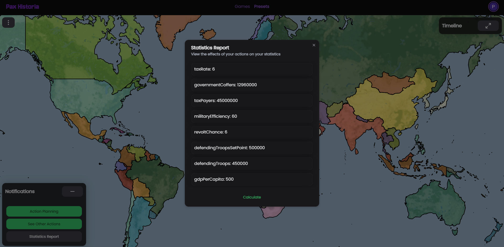

# 📈 Statistics Changes

Pax Historia attempts to be as simple as possible, yet, given history's complexities, many details couldn't get cut. Regardless, here are the statistics that exist in the game:\
\
GDP Per Capita: Rough Estimation of the GDP per capita in 2020 USD of the people in a region/faction. Swayed more by Game Balance than historical or mathematical accuracy.

<figure><figcaption></figcaption></figure>

Total Population: Total number of people in a nation.\
Core Population: Total number of taxpayers in a nation.

Tax Rate: Average Taxes in Percent.

Government Coffers: Treasury of the nation. Usually defined by Population multiplied by GDP Per Capita multiplied by the tax rate every month. Swayed more by Game Balance than historical or mathematical accuracy.

Defending Troops: Total number of troops the faction has in its army.

Defending Troops Set Point: The number of troops the faction wants to have in its army. And will slowly build towards.

Military Efficiency: A percentage, scale 1-100 defining how efficient and high quality a faction army is. 100 being powerful and advanced, 50 being Incredibly weak and corrupt, 1 being nonexistent and technologically lost.

Military Access: The Nations that can move their troops through your land.
