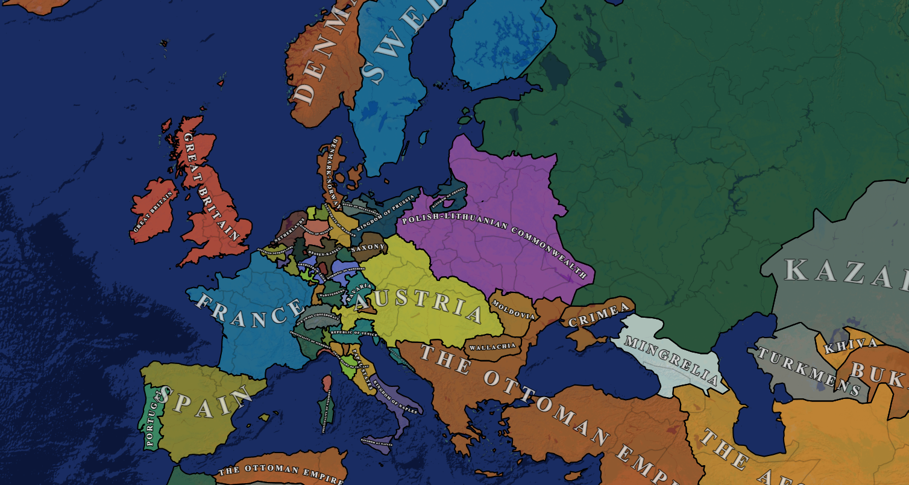

# 🗺️ The Map

The Map is a basic run of the mill map. It will always include the whole world and often has 200-700 regions to represent the areas, depending on the preset. Differing of course based on historical context and date. There's not too much interaction required directly on the map, it's a simple visual representation of your conquest.\

<figure><figcaption></figcaption></figure>

