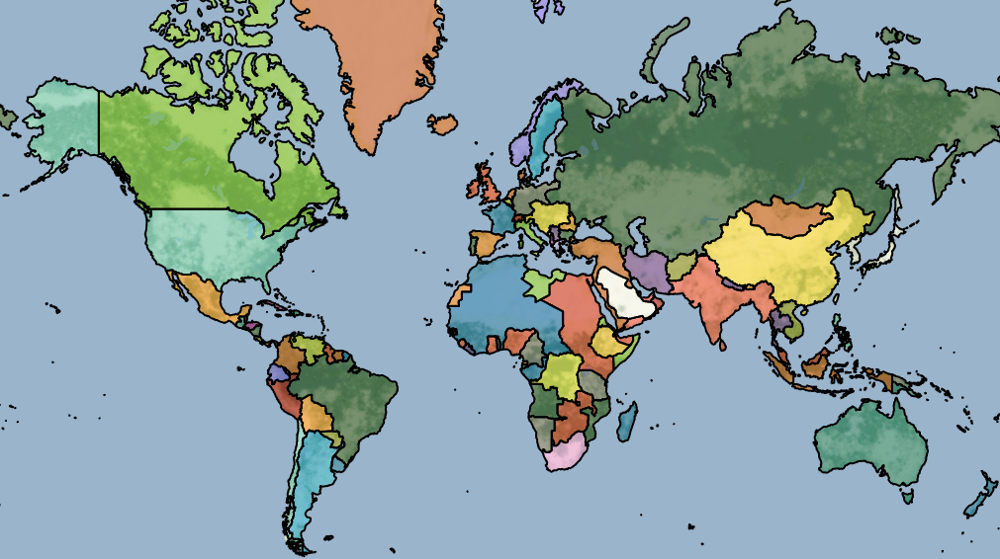
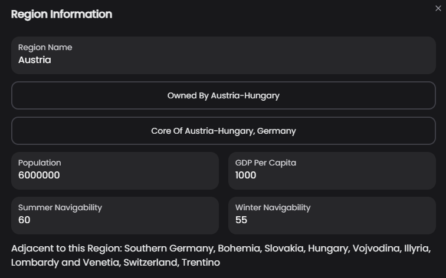

# 🗺️ The Map

The Map is a basic run of the mill map. It will always include the whole world and often has over 200 regions to represent the areas. Differing of course based on historical context and date. There's not too much interaction required from the map, it's simple a visual representation of your conquest and glories!\

<figure><figcaption></figcaption></figure>

Each Region has multiple fields:\
Population, GDP per Capita, Owner, Core Of, and Summer and Winter Navigability.\
\
GDP per capita in 2020 USD: differing and determined for game balance. \
Owner: is whatever faction owns the region. \
Core Of: is whatever faction has that region as a Core, which means how integrated that region is into the Faction.\
Winter Navigability is the affinity for movement in the region during Winter. \
Summer Navigability is the affinity for movement in the region during Summer.\
Higher numbers means easier movement. One a Scale of 1-100.\

<figure><figcaption></figcaption></figure>
